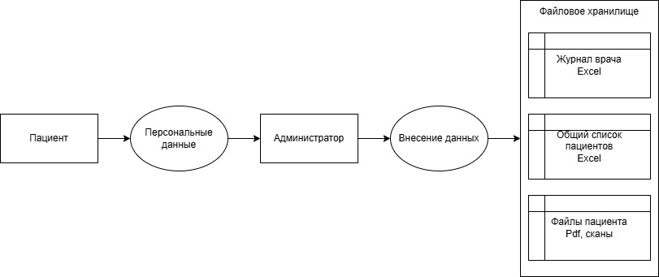
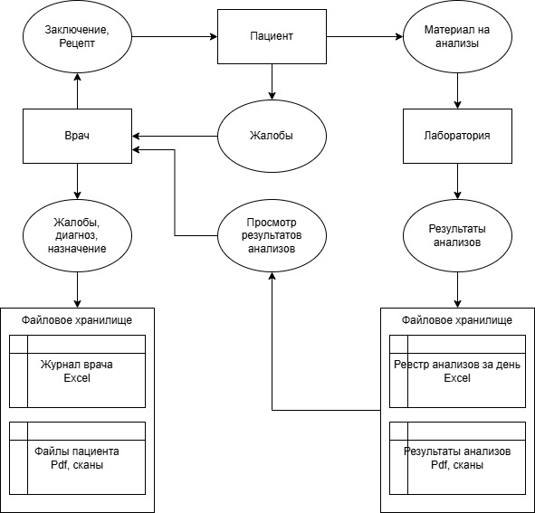
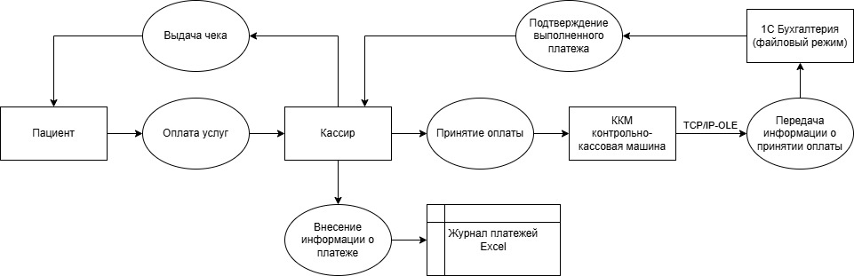
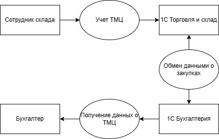
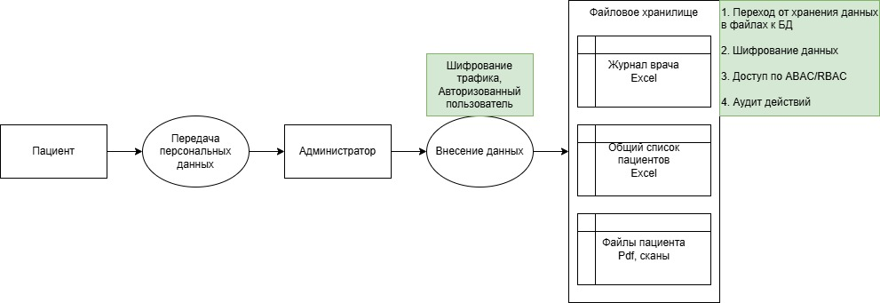
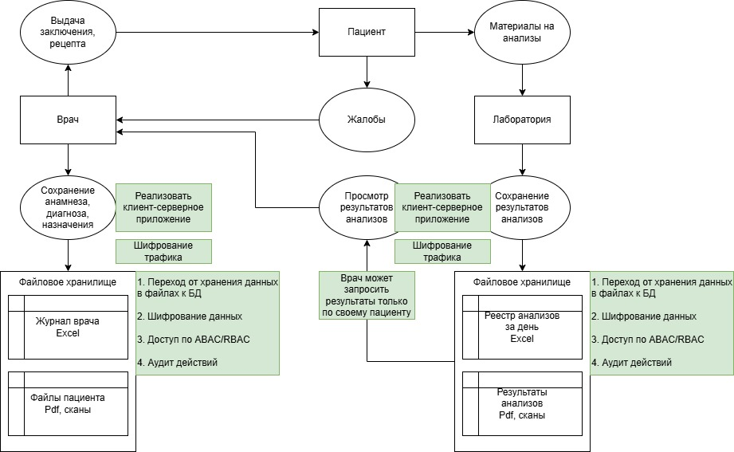
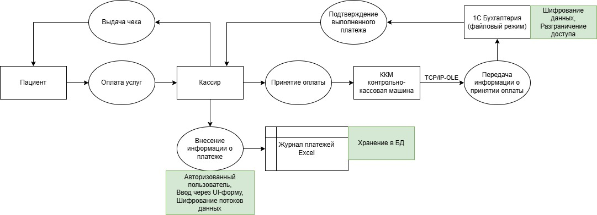
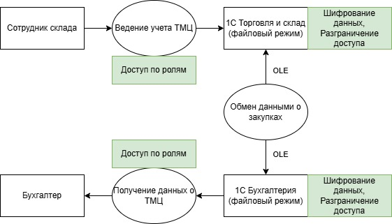

## Задание 1. Анализ безопасности системы

### Диаграммы потоков данных as-is

#### Запись на прием

#### Прием пациента

#### Оплата услуг

#### Учет товарно-материальных ценностей

### Обнаруженные категории конфиденциальных данных

- **Персональные данные**: ФИО, дата рождения, телефон, e-mail, серия/номер паспорта, адрес регистрации/проживания
- **Данные контрактов**: Номера договоров, условия обслуживания
- **Медицинские данные**: Диагнозы, назначения, результаты анализов
- **Финансовые данные**: Факты оплаты, суммы, кассовые чеки

### Выявленные проблемы

1. Отсутствие контроля доступа к данным. Любой сотрудник компании может получить доступ к практически любым данным.
2. Отсутствует механизм шифрования данных как при хранении, так и при передаче.
3. Отсутствует аудит доступа к файлам и действий с данными.
4. Отсутствуют средства оповещения об инцидентах или аномальных активностях.
5. Не определён срок хранения данных.
6. Отсутствует резервное копирование данных.
7. Отсутствует политика обработки персональных данных.
8. Отсутствует механизм анонимизации данных.
9. Отсутствует механизм отзыва согласия на обработку персональных данных.

### Список данных для защиты и методы их защиты

| **Категория**       | **При хранении**                                                       | **При передаче**     | **При использовании**                                       |
|---------------------|------------------------------------------------------------------------|----------------------|-------------------------------------------------------------|
| Персональные данные | Шифрование БД/файлов (AES-256), шифрование бэкапов                     | TLS 1.2+             | Маскирование в отчётах; токенизация идентификаторов         |
| Медицинские данные  | Шифрование на уровне БД/файлов; ограниченный доступ по ролям/атрибутам | mTLS между сервисами | Деперсонализация для BI/ML; отдельные скоупы доступа        |
| Финансовые данные   | Шифрование БД 1С/файлов; журналирование операций                       | TLS                  | Маскирование PAN/чеков в отчетах, доступ только бухгалтерии |
| Документы/сканы     | Объектное хранилище с шифрованием и версиями                           | TLS                  | Запрещён экспорт вне безопасной зоны                        |
| Логи/журналы        | Централизованное хранилище с шифрованием                               | TLS/mTLS             | Обфускация пользовательских идентификаторов                 |

### Тегирование данных

- **Теги**: PII (персональные данные), med (медицинские данные), finance (финансовые данные), log (логи), internal (внутренние данные)
- **Хранение тегов**: В БД (таблица с тегами и описанием), в файловом хранилище (как метаданные), в логах (поля с тегами)

### Инструменты защиты

- **Аутентификация/авторизация**: Keycloak (OIDC), запрет общих учёток, журналирование сессий
- **Шифрование**: TLS 1.2/1.3
- **DLP**: Symantec DLP

### Диаграммы потоков данных to-be

#### Запись на прием

#### Прием пациента

#### Оплата услуг

#### Учет товарно-материальных ценностей
