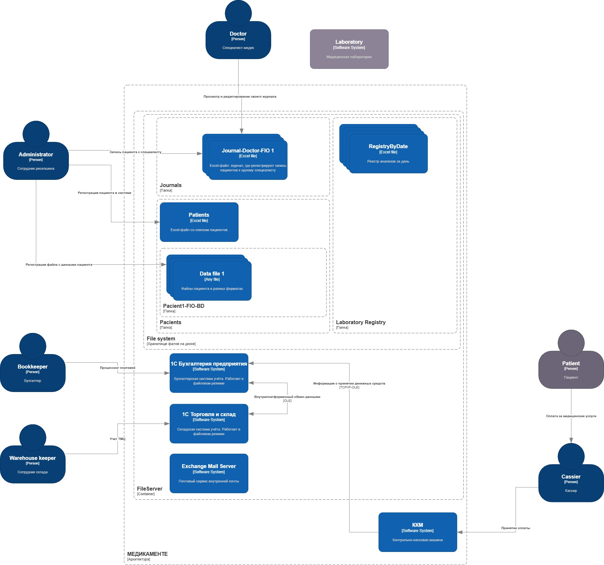
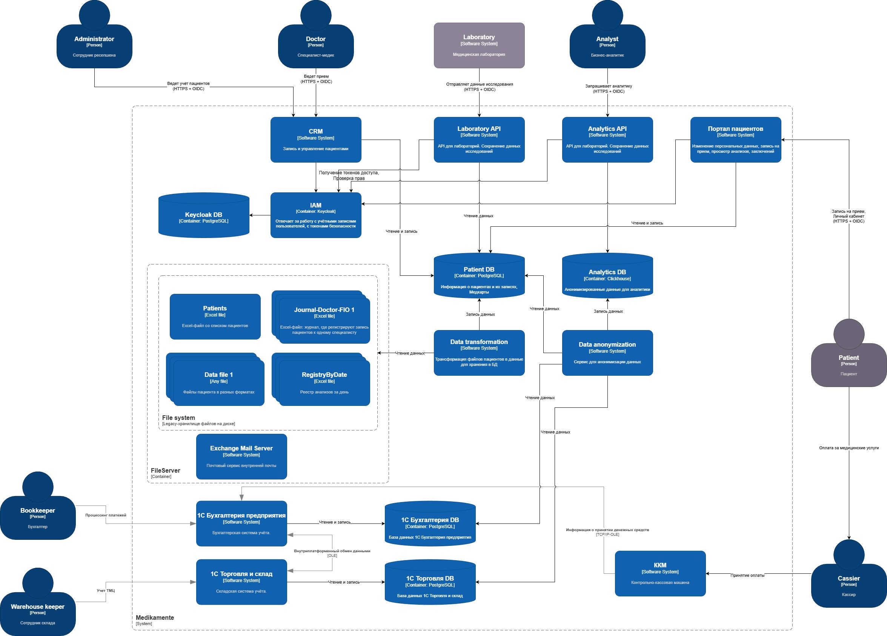

## Архитектура as-is

## Решение с учётом принципов Privacy by Design

- Хранение согласия пациента на обработку персональных данных в системе
- Управление доступом (RBAC + ABAC): врач — доступ только к своим пациентам и только к данным с тегом med; ресепшен — доступ только к расписанию, договорам и контактным данным; бухгалтерия — доступ только к данным с тегами finance.
- Минимизация данных: собирать только необходимые для услуги данные
- Предоставить пользователям сервис, где они могут просматривать свои личные данные и управлять ими
- Шифрование и защита каналов: Все данные в хранилищах — шифрование AES-256, TLS/mTLS для всех API и интеграций
- Аудит: Логирование всех обращений к med и PII, автоматические алерты
- Тегирование данных: автоматическая классификация (PII, finance, med)
- Анонимизация данных для передачи в аналитику
- Уход от хранения данных в excel/файлах в пользу БД

## Архитектура to-be

