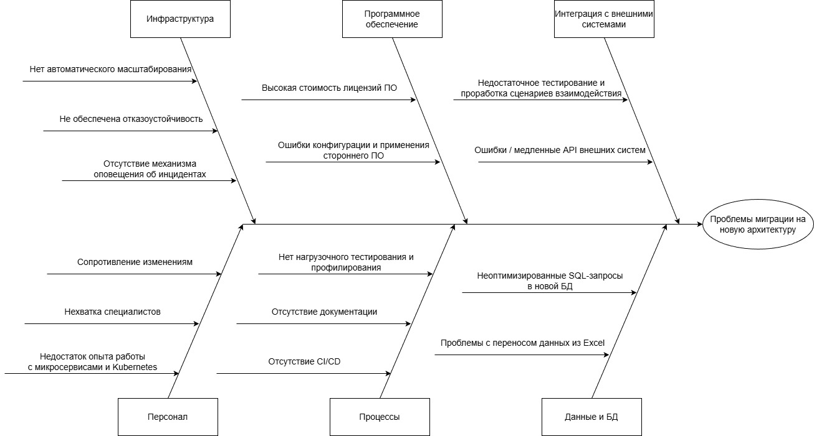

## Задание 4. Оценка узких мест при миграции

### Диаграмма Исикавы для структурного анализа узких мест

### Рекомендации по устранению проблем

**Персонал**
- Найм персонала с необходимыми скилами
- Проведение обучения по работе с новой системой, сбор обратной связи

**Процессы**
- Настроить CI/CD (автоматические сборки, тесты, деплой)
- Добавить нагрузочные тесты, проводить их регулярно. Добавить профилирование
- Разработать базу знаний с информацией, необходимой команде для быстрого доступа к решениям

**Данные**
- Оптимизация SQL-запросов, создание индексов, профилирование
- Автоматизировать перенос данных. Провести ручную проверку на отсутствие потерянных данных
- Проведение аудитов данных; проведение уничтожения старых данных

**Программное обеспечение**
- По возможности использовать бесплатное ПО
- Протестировать работу стороннего ПО, привлечь экспертов

**Инфраструктура**
- Перенос в Kubernetes с авто-масштабированием
- Использование балансировщика нагрузки, резервное копирование данных, внедрение паттернов вроде Circuit Breaker для предотвращения каскадных отказов
- Внедрение системы SIEM для мониторинга инцидентов ИБ; мониторинг через Prometheus и Grafana + настройка алертинга

**Интеграция с внешними системами**
- Rate limiting для лимитирования запросов от внешних систем
- OpenAPI спецификация для описания REST API

Обеспечение мониторинга, алертинга, отказоустойчивости, контроля доступа к данным - задачи с наивысшим приоритетом.